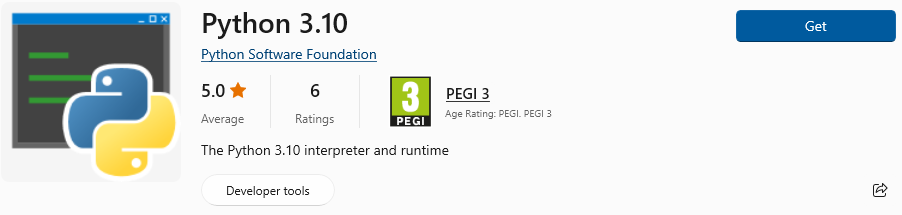
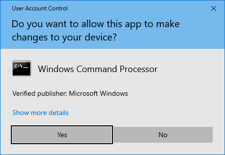
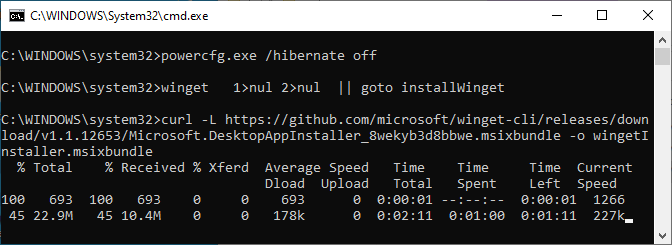
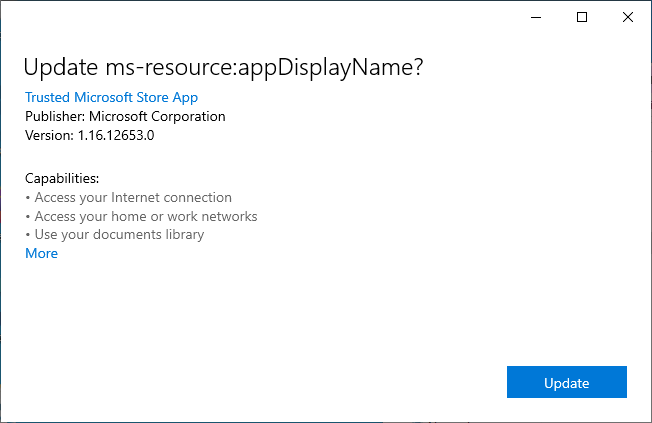
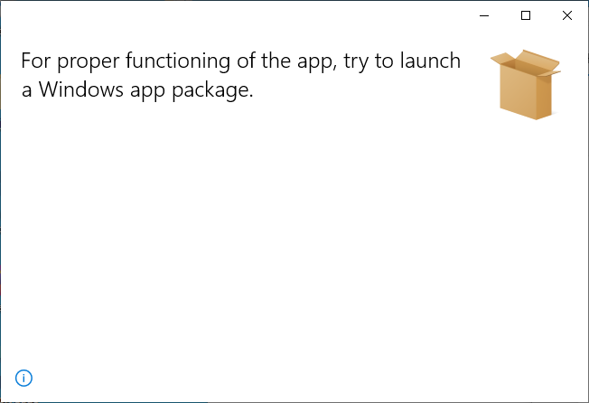
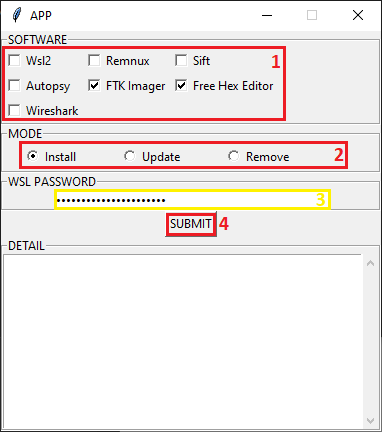
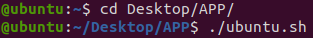
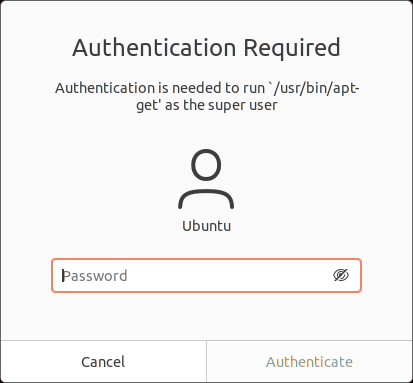
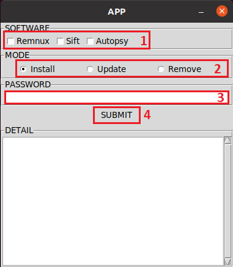

Developed by [Thales Group CERT](https://github.com/thalesgroup-cert).

---

# Forensic Analysis Software Toolbox - FAST
For investigation purpose, you can automatically install forensic software in your virtual machine. FAST works well on hosts too, but this approach is not recommended in case of of malware processing.

#### Tested on
- Windows 10 (system 64x) version 20H2
- Ubuntu 20.04.3 LTS (64-bit)

#### Goals
- The script install DFIR pieces of software without almost no user interaction
- Update and remove easily already installed software
- Running on Windows and Linux based systems

#### Why FAST?
- To ease software installation
- To help people in countries with slow internet connection
- To avoid downloading Virtual Machine with large amout of data

## Prerequisites
You can install forensic software in your own computer, but it's **highly recommended** to install it into a Virtual Machine.

#### Installation of software in Virtual Machine
- VMWare Workstation Pro / Virtual Box / Other Virtual Machine Software Programs
- ISO Ubuntu 20 / ISO Windows 10

#### General Setup
- Once your Virtual Machine is running, make sure **to do all the updates**, otherwise the program might not work properly
- **Turn off standby and hibernation** to avoid stopping software installation
- If required, download **FTKImager** separately (https://www.exterro.com/ftk-imager) and drop the installer in "Softwares > FtkImager" folder
- **Disable the antivirus** if you are installing **Nirsoft software** as it could trigger alerts and remove binaries considered as hacktools

___

# WINDOWS 10

## Setup for installation

##### 1. DOWNLOAD PYTHON
Go to Microsoft Store and download Python 3
[](Documentation/Ressources/Windows/python.png)
##### 2. Open FAST directory
- Go to `Setup` folder and execute `windows.bat` script
- Click `Yes` button to give the script administrator rights, it will install Winget and Tkinter
[](Documentation/Ressources/Windows/admin_right2.png)

##### 3. User interaction might be required during Winget installation:
- You will see Winget installation processing
[](Documentation/Ressources/Windows/winget1.png)

- If Winget is already installed, you won't have to do anything
- Otherwise, you have to click on `Update` button that appears, then close that window
 
[](Documentation/Ressources/Windows/winget2.png)
[](Documentation/Ressources/Windows/winget3.png)


## How to use the programm on Windows 10
- Click on `Launch_Windows.bat` to run the program and let the application to run as administrator

[](Documentation/Ressources/Windows/admin_right2.png)

##### 1. Check the software that you want to install or update

##### 2. Choose your mode (Install / Update / Remove)

##### 3. (Optional) If you want to install or update a software using wsl, you need to put the password of your Ubuntu Windows Subsystem
- For the `first installation`, it creates a user in the ubuntu subsystem
- Add your `WSL password` on the input if you are `installing or updating a software using WSL`

```
Default WSL username and password
- Username: user
- Password: root
```

Make sure ``to change the password after installation``

##### 4. Click on submit

##### 5. Check the detail of the process  

[](Documentation/Ressources/Windows/usage_windows.png)

___


# UBUNTU 20.04.3


## Setup for installation
##### 1. Go to the FAST directory with command prompt
```cd 'to the related directory'```  

##### 2. Give the right to the setup file to be launched, then launch it to install python3 and tkinter
```
cd Setup
chmod 764 ubuntu.sh
./ubuntu.sh
```  
The file ubuntu.sh is only used to setup FAST and to install dependancies.

[](Documentation/Ressources/Ubuntu/launch_ubuntu_sh.png)

##### 3. Enter your password to install Python3 and Tkinter

[](Documentation/Ressources/Ubuntu/request_password.png)


## How to use the program on Ubuntu 20.04.3

Launch the program from the command prompt
```
python3 FAST.py
```

##### 1. Check the software that you want to install or update

##### 2. Choose your mode (Install / Update / Remove)

##### 3. Enter your password in order to let the app to be a super admin

##### 4. Click on submit

##### 5. Check the detail of the process

[](Documentation/Ressources/Ubuntu/usage_ubuntu.png)

___

# Tree
```
├── README.md
├── FAST.py
├── Classes.py
├── Json.py
├── Launch_Windows.bat
├── Setup
│   ├── ubuntu.sh
│   ├── windows.bat
│   └── build_md.py
├── Documentation
│   ├── CheatSheet SANS
│   │   ├── cheatsheet.pdf
│   │   └── ...
│   ├── Ressources
│   │   ├── ressources.png
│   │   └── ...
│   ├── Troubleshooting
│   │   ├── troubleshooting.png
│   │   └── ...
│   └── Software
│       ├── Autopsy.md
│       ├── Cyberchef.md
│       ├── ...
│       ├── Ubuntu.md
│       └── Windows.md
├── Tutorial
│   ├── Setup_ubuntu.mp4
│   ├── Tutorial.mkv
│   └── ...
└── Softwares
    ├── Example.json
    ├── Autopsy
    │   ├── installAutopsy.sh
    │   ├── installAutopsy.bat
    │   ├── updateAutopsy.bat
    │   ├── removeAutopsy.bat
    │   └── Autopsy.json
    ├── CyberChef
    │   ├── Cyberchef.py
    │   ├── requirements.txt
    │   └── Cyberchef.json
    ├── FTKImager
    │   ├── FTKImager.exe (Download the executable in https://www.exterro.com/ftk-imager)
    │   ├── installFtkImager.bat
    │   └── FtkImager.json
    └── ...
```
___

# LICENSE

The FAST code is released under the Massachusetts Institute of Technology (MIT) license. See LICENSE for details.

## EMBEDDED SOFTWARE

This section lists the software components and libraries that are distributed by FAST.

You can find a specific documentation related to each software you can install in `Documentation > Software`.
- Ubuntu.md : a summary of all the software that can be install in ubuntu operating system
- Windows.md : a summary of all the software that can be install in windows operating system

##### Autopsy
- Web page: https://www.autopsy.com/
- License: https://github.com/sleuthkit/autopsy/blob/develop/LICENSE-2.0.txt

##### Cyberchef
- Web page: https://github.com/gchq/CyberChef
- License: https://github.com/gchq/CyberChef/blob/master/LICENSE

##### FreeHexEditor (Freeware)
- Web page: https://www.hhdsoftware.com/free-hex-editor

##### FtkImager
- Web page: https://www.exterro.com/ftk-imager

##### Remnux
- Web page: https://remnux.org
- License: https://docs.remnux.org/behind-the-scenes/license

##### Sift
- Web page: https://www.sans.org/tools/sift-workstation/
- License: https://github.com/teamdfir/sift/blob/master/LICENSE

##### Wireshark
- Web page: https://www.wireshark.org/
- License: https://www.wireshark.org/docs/wsdg_html_chunked/AppGPL.html

##### WSL
- Web page: https://learn.microsoft.com/en-us/windows/wsl/
- License: https://github.com/ubuntu/WSL/blob/main/LICENSE


## EMBEDDED RESOURCES

This section lists other resources, such as cheatsheets that are used by FAST.  

##### SANS Cheatsheets
- Web page: https://www.sans.org/blog/the-ultimate-list-of-sans-cheat-sheets/
- General IT Security:
    - ABCs of Cybersecurity: https://assets.contentstack.io/v3/assets/blt36c2e63521272fdc/blt88a4f4d475dd6337/6140c2e9d4224e7daaed054f/Flyer_ABCs-Cybersecurity-Terms_v1.pdf
    - Windows and Linux Terminals & Command Lines: https://assets.contentstack.io/v3/assets/blt36c2e63521272fdc/bltea7de5267932e94b/5eb08aafcf88d36e47cf0644/Cheatsheet_SEC301-401_R7.pdf
    - TCP/IP and tcpdump: https://sansorg.egnyte.com/dl/8VIrX1K87d/?
    - IPv6 Pocket Guide: https://sansorg.egnyte.com/dl/b5cWH0WLwZ
    - PowerShell Cheat Sheet: https://assets.contentstack.io/v3/assets/blt36c2e63521272fdc/bltf146e4f361db3938/5e34a7bc946d717e2eab6139/power-shell-cheat-sheet-v41.pdf?msc=Cheat+Sheet+Blog
    - Writing Tips for IT Professionals: https://zeltser.com/media/docs/writing-tips-for-it-professionals.pdf
    - Tips for Creating and Managing New IT Products: https://zeltser.com/media/docs/new-product-management-tips.pdf?msc=Cheat+Sheet+Blog
    - Tips for Getting the Right IT Job: https://zeltser.com/media/docs/getting-the-right-it-job-tips.pdf?msc=Cheat+Sheet+Blog
    - Tips for Creating a Strong Cybersecurity Assessment Report: https://zeltser.com/media/docs/security-assessment-report-cheat-sheet.pdf?msc=Cheat+Sheet+Blog
    - Critical Log Review Checklist for Security Incidents: https://www.sans.org/brochure/course/log-management-in-depth/6?msc=Cheat+Sheet+Blog
    - Security Architecture Cheat Sheet for Internet Applications: https://zeltser.com/media/docs/security-architecture-cheat-sheet.pdf?msc=Cheat+Sheet+Blog
    - Tips for Troubleshooting Human Communications: https://zeltser.com/human-communications-cheat-sheet/?msc=Cheat+Sheet+Blog
    - Security Incident Survey Cheat Sheet for Server Administrators: https://zeltser.com/media/docs/security-incident-survey-cheat-sheet.pdf?msc=Cheat+Sheet+Blog
    - Network DDoS Incident Response Cheat Sheet: https://zeltser.com/media/docs/ddos-incident-cheat-sheet.pdf?msc=Cheat+Sheet+Blog
    - Information Security Assessment RFP Cheat Sheet: https://zeltser.com/media/docs/security-assessment-rfp-cheat-sheet.pdf?msc=Cheat+Sheet+Blog
    - Python 3 Essentials: https://assets.contentstack.io/v3/assets/blt36c2e63521272fdc/blt81d030ecd27e1e5d/5e50122503d2600dc053d3ee/Python3-Cheat-Sheet.pdf
- Digital Forensics and Incident Response:
    - JSON and jq Quick Start Guide: https://sansorg.egnyte.com/dl/7qF6tbGgWx
    - SIFT Workstation Cheat Sheet: https://sansorg.egnyte.com/dl/rcC7AFiUr0
    - Tips for Reverse-Engineering Malicious Code: https://sansorg.egnyte.com/dl/pHqHxaLC5M
    - REMnux Usage Tips for Malware Analysis on Linux: https://sansorg.egnyte.com/dl/X7Hif4acY0
    - Analyzing Malicious Documents: https://sansorg.egnyte.com/dl/YrwOdFIm1I
    - Malware Analysis and Reverse-Engineering Cheat Sheet: https://sansorg.egnyte.com/dl/suRa4RLonp
    - SQlite Pocket Reference Guide: https://sansorg.egnyte.com/dl/KKxPl6LsbF
    - Eric Zimmerman's tools Cheat Sheet: https://sansorg.egnyte.com/dl/cOBcwZSosv
    - Rekall Memory Forensics Cheat Sheet: https://sansorg.egnyte.com/dl/L4hx0pM9y3
    - Linux Shell Survival Guide: https://sansorg.egnyte.com/dl/EDP6XtXMOh
    - Windows to Unix Cheat Sheet: https://sansorg.egnyte.com/dl/OmZRZGy0uT
    - Memory Forensics Cheat Sheet: https://sansorg.egnyte.com/dl/LVvF5jRNLK
    - Hex and Regex Forensics Cheat Sheet: https://sansorg.egnyte.com/dl/ZvGHqvRS3X
    - FOR518 Mac & iOS HFS+ Filesystem Reference Sheet: https://assets.contentstack.io/v3/assets/blt36c2e63521272fdc/blt61c336e02577e733/5eb0940e248a28605479ccf0/FOR518_APFS_CheatSheet_012020.pdf
    - iOS Third-Party Apps Forensics Reference Guide Poster: https://sansorg.egnyte.com/dl/TeOraX38Od
    - oledump.py Quick Reference: https://sansorg.egnyte.com/dl/3ydBhha67l
- Offensive Operations:
    - Windows Intrusion Discovery Cheat Sheet v3.0: https://sansorg.egnyte.com/dl/4oAuAf70Zt
    - Intrusion Discovery Cheat Sheet v2.0 (Linux): https://sansorg.egnyte.com/dl/ejj5SM2pjA
    - Intrusion Discovery Cheat Sheet v2.0 (Windows 2000): https://assets.contentstack.io/v3/assets/blt36c2e63521272fdc/bltd6fa777a3215f34a/5eb08aae08d37e6d82ef77fe/win2ksacheatsheet.pdf
    - Windows Command Line: https://sansorg.egnyte.com/dl/AvZo1dS7kI
    - Netcat Cheat Sheet: https://sansorg.egnyte.com/dl/Rop1b0ElWo
    - Burp Suite Cheat Sheet: https://sansorg.egnyte.com/dl/x19ByeTOpS
    - BloodHound Cheat Sheet: https://sansorg.egnyte.com/dl/zscX9KYH5M
    - Misc Tools Cheat Sheet: https://sansorg.egnyte.com/dl/i37NHz5yUh
    - Windows Command Line Cheat Sheet: https://assets.contentstack.io/v3/assets/blt36c2e63521272fdc/blt4e45e00c2973546d/5eb08aae4461f75d77a48fd4/WindowsCommandLineSheetV1.pdf
    - SMB Access from Linux Cheat Sheet: https://assets.contentstack.io/v3/assets/blt36c2e63521272fdc/blta6a2ae64ec0ed535/5eb08aaeead3926127b4df44/SMB-Access-from-Linux.pdf
    - Pivot Cheat Sheet: https://sansorg.egnyte.com/dl/kZpaAx3eX0
    - Google Hacking and Defense Cheat Sheet: https://sansorg.egnyte.com/dl/f4TCYNMgN6
    - Scapy Cheat Sheet: https://wiki.sans.blue/Tools/pdfs/ScapyCheatSheet_v0.2.pdf
    - Nmap Cheat Sheet: https://assets.contentstack.io/v3/assets/blt36c2e63521272fdc/blte37ba962036d487b/5eb08aae26a7212f2db1c1da/NmapCheatSheetv1.1.pdf
- Cloud Security:
    - Multicloud Cheat Sheet: https://sansorg.egnyte.com/dl/1JHG4g0U5D
    - Powershell for Enterprise & Cloud Compliance: https://sansorg.egnyte.com/dl/WKKG4fZ6WX
    - Cloud Security and DevOps Cheat Sheet: https://sansorg.egnyte.com/dl/uDa5sqjDeH
- Cybersecurity Leadership:
    - Ransomware + Healthcare: A Deadly Combination: https://assets.contentstack.io/v3/assets/blt36c2e63521272fdc/bltff1105a558ca6743/60f8193e40219d481f07518b/Flyer_Healthcare_Ransomeware_Final.pdf
    - What Your Privacy Officer is Trying to Tell You...If Only You Would Listen: https://assets.contentstack.io/v3/assets/blt36c2e63521272fdc/blte08d737d5bb31819/612d36118f8f7644bdf4d159/Flyer-DocBlackburn-SANS-HIPAA-Privacy.pdf
    - Powershell for Enterprise & Cloud Compliance: https://sansorg.egnyte.com/dl/WKKG4fZ6WX
- All Around Defenders Primers: 
    - Linux CLI 101: https://wiki.sans.blue/Tools/pdfs/LinuxCLI101.pdf
    - Linux CLI: https://wiki.sans.blue/Tools/pdfs/LinuxCLI.pdf
    - Powershell Primer: https://wiki.sans.blue/Tools/pdfs/PowerShell.pdf
    - PowerShell Get-WinEvent: https://wiki.sans.blue/Tools/pdfs/Get-WinEvent.pdf
